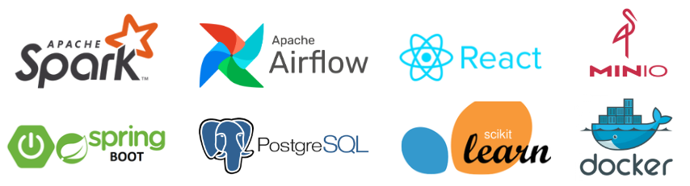

# Investor AI Website

Welcome to the stock price prediction project! This project leverages modern technologies like Airflow, Spark, MinIO, Java, React.js, Machine Learning and Docker to build a complete system, from data collection and processing to model building and deployment of a web interface that allows users to interact with and view prediction results.



## Website Introduction

The project's website provides an intuitive interface for users to:

*   **View stock price information:** Price charts, statistical indicators.
*   **Predict prices:** Enter a stock symbol and a prediction period; the system will display the results.
*   **Evaluate the model:** See model performance metrics (e.g., RMSE, MAE).


## System Architecture

[System Architecture Image ( Not yet )]

The project is deployed based on a microservices architecture, with the following key components:

*   **Frontend:** User interface (React.js).
*   **Backend (API):** Provides APIs for the frontend and other services (Spring Boot - Java).
*   **Airflow:** Manages the workflow of data collection, processing, and model training.
*   **Spark:** Processing and machine learning model training* Handles large-scale data pr.
*   **MinIO:** Stores data (data lake) and models.

## How to Run the Project (Docker Compose)

The project is packaged using Docker and managed with Docker Compose, making deployment easy and consistent across all environments.

1.  **Install Docker and Docker Compose:**
    Make sure you have Docker and Docker Compose installed on your machine. Installation instructions:
    *   Docker: [https://docs.docker.com/get-docker/](https://docs.docker.com/get-docker/)
    *   Docker Compose: [https://docs.docker.com/compose/install/](https://docs.docker.com/compose/install/)

2.  **Clone the Project:**

    ```bash
    git clone https://github.com/ltdungg/Investor-AI-Website.git
    cd Investor-AI-Website
    ```

3.  **Environment for access:**

    ```
    # POSTGRES
    POSTGRES_USER=airflow
    POSTGRES_PASSWORD=airflow
    POSTGRES_DB=airflow
    POSTGRES_STOCK_SCHEMA=stock
    
    # AIRFLOW
    AIRFLOW_USERNAME=airflow
    AIRFLOW_PASSWORD=airflow
    
    # MINIO
    MINIO_ROOT_USER=admin
    MINIO_ROOT_PASSWORD=admin123456789
    ```

4.  **Run Docker Compose:**

    ```bash
    docker compose up --build -d
    ```

    This command will download the necessary images (if not already present), build containers, and start the services. The `-d` option runs the containers in detached mode (in the background).

5.  **Stop the Project**

    ```bash
     docker compose down
    ```

## Data Import (Volumes)

The project uses Docker Volumes to manage data, ensuring that data is not lost when containers are deleted.

1.  **Download volume from Google Drive for data:**
    1. PostgreSQL volume: [Click here to download](https://drive.google.com/drive/folders/1s60rTqqWHU4lb1BU7u4hvJ_eUIZfJNOV?usp=drive_link)
    2. MinIO volume: [Not yet]()

2.  **Import Data into Volumes:**
    1. Import PostgreSQL volume:
       - Select docker volume in Docker Desktop Volumes UI: **investor-ai-website_postgres-db-volume**
       - Select **Import**.
       - Select **Local file** and **Browse** your file .tar.gz you just downloaded from Google Drive.
       - Select **Import**.
    2. Import MinIO Volume:
       - Not yet.
## Access Ports
Below are the default ports for the services in the project.  You can change these ports in the `docker-compose.yaml` file.

| Service       | Port (Host)   | Port (Container)   | Description                                |
|---------------|---------------|--------------------|--------------------------------------------|
| Frontend      | `localhost`   | `3000`             | User interface                             |
| Backend (API) | `localhost` | `8000` | Application API                            |
| Airflow       | `localhost`   | `8080`             | Airflow Web UI                             |
| Spark         | `localhost`   | `8081, 7077`       | Spark Master UI (8081),Spark Master (7077) |
| MinIO         | `localhost`   | `9001, 9000`       | MinIO Console (9001), MinIO API (9000)     |
| [Not yet]     |               |                    |                                            |


 For example: `http://localhost:3000` to access the frontend, `http://localhost:8080` to access Airflow.

